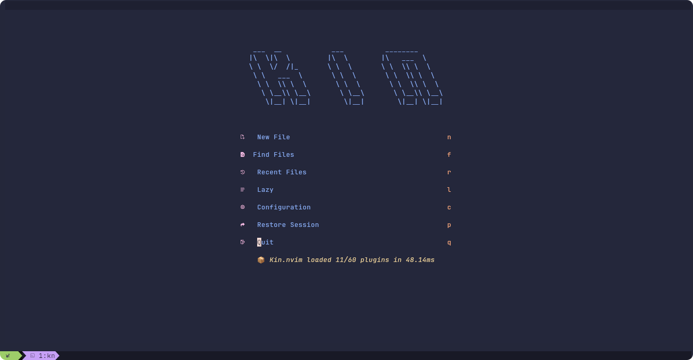
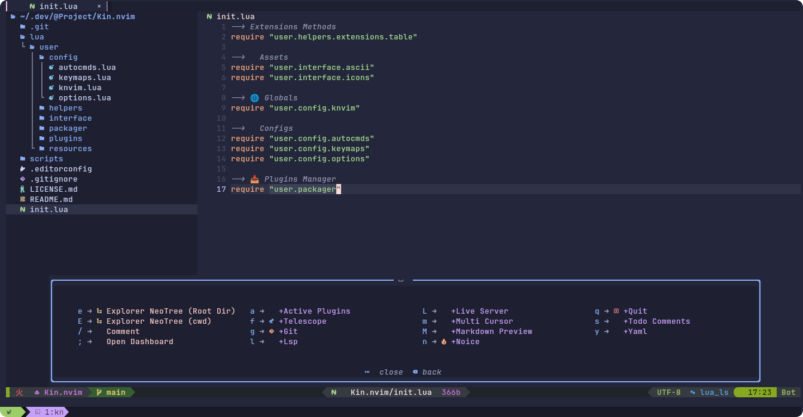

<h1 align="center">🍡 Kin.nvim</h1>

<p align="center">
  <i>These are my settings for <strong>Neovim</strong>.</i>
  
  
</p>

---

## 🚧 Requirements

- Git
- Neovim >= 9.5
- Tools
  - fzf
  - ripgrep
  - Clipboard Tool (necessary for the integration with the system clipboard)
- Package Managers
  - Pip
  - Npm
  - Cargo
  - LuaRocks (optional)
- Powershell 7 or higher (for Windows user)

## 🛠️ Installation

### > Linux/Mac OS (Unix)

1. Make a backup of your current nvim and shared folder

```sh
mv ~/.config/nvim ~/.config/nvim.bak
mv ~/.local/share/nvim ~/.local/share/nvim.bak
```

2. Clone this repo

```sh
git clone --depth 1 https://github.com/CainCarmo/Kin.nvim ~/.config/nvim
rm -rf ~/.config/nvim/.git
rm -rf ~/.config/nvim/.gitignore
nvim
```

### > Windows (Powershell)

1. Make a backup of your current nvim and nvim-data folder

```pwsh
Rename-Item -Path $env:LOCALAPPDATA\nvim -NewName $env:LOCALAPPDATA\nvim.bak
Rename-Item -Path $env:LOCALAPPDATA\nvim-data -NewName $env:LOCALAPPDATA\nvim-data.bak
```

2. Clone this repo

```pwsh
git clone --depth 1 https://github.com/AstroNvim/template $env:LOCALAPPDATA\nvim
Remove-Item $env:LOCALAPPDATA\nvim\.git -Recurse -Force
Remove-Item $env:LOCALAPPDATA\nvim\.gitignore -Recurse -Force
nvim
```

## File Structure

You may add your plugin in `lua/user/plugins` or `lua/user/plugins/langs`. All files there
will be automatically loaded by [lazy.nvim](https://github.com/folke/lazy.nvim)

```txt
~/.config/nvim
├── lua
│   └── user
│       ├── config
│       │   ├── autocmds.lua
│       │   ├── keymaps.lua
│       │   ├── knvim.lua
│       │   └── options.lua
│       ├── helpers
│       │   └── extensions
│       │       └── table.lua
│       ├── interface
│       │   ├── ascii.lua
│       │   └── icons.lua
│       ├── packager
│       │   └── init.lua
│       ├── plugins
│       │   ├── langs
│       │   │   ├── spec1.lua
│       │   │   ├── spec2.lua
│       │   │   └── ...
│       │   ├── spec1.lua
│       │   ├── spec2.lua
│       │   └── ...
│       └── resources
│           └── lspconfig
│              ├── jsonls.lua
│              ├── lua_ls.lua
│              └── yamlls.lua
│
└── init.lua
```

## Credits

The development of Kin.nvim was inspired by incredible projects that have my sincere thanks to the following repositories:

- [NvChad](https://github.com/NvChad/NvChad)
- [LunarVim](https://github.com/LunarVim/LunarVim)
- [LazyVim](https://github.com/LazyVim/LazyVim)

> © 2024 Cainã Carmo
